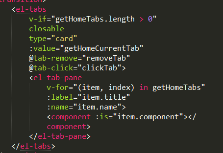
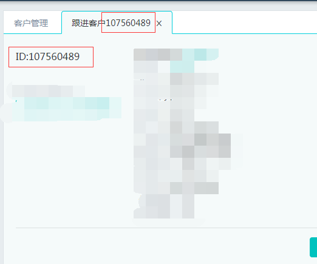
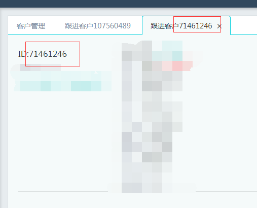
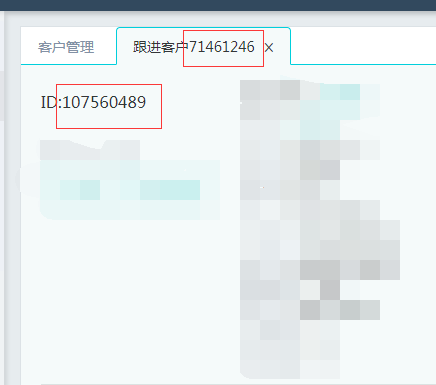
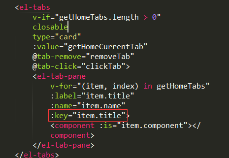
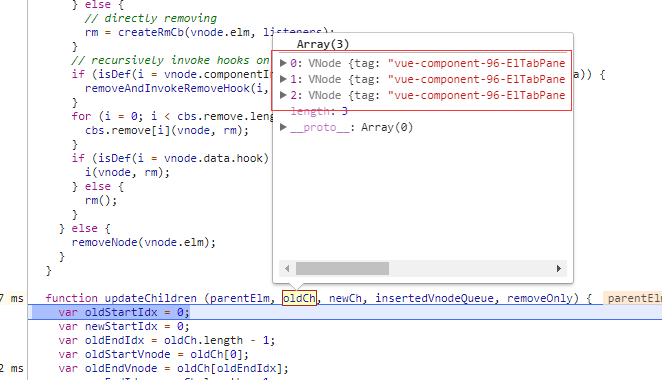
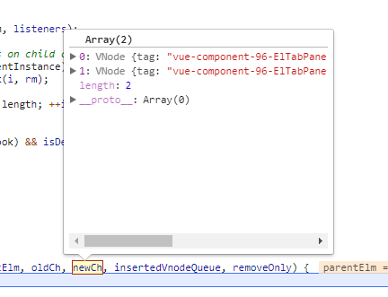
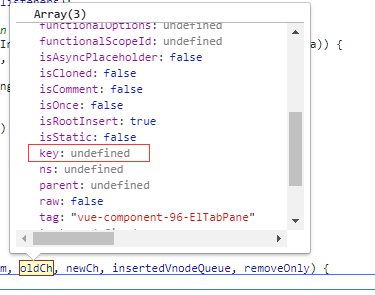
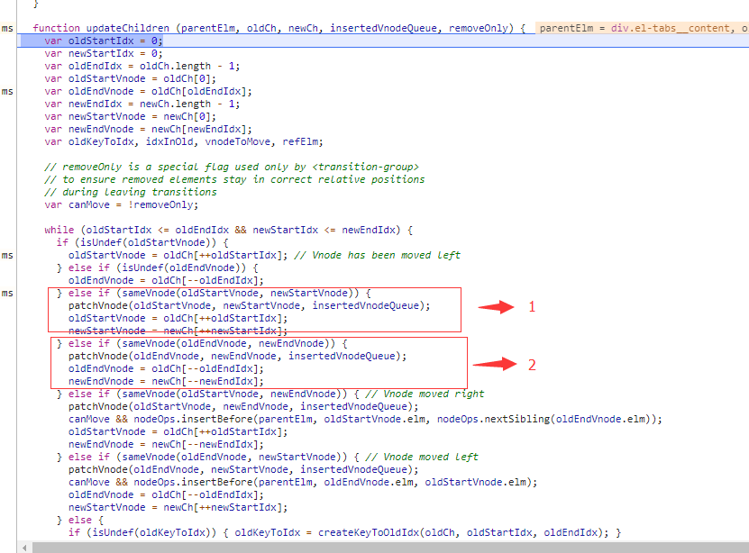
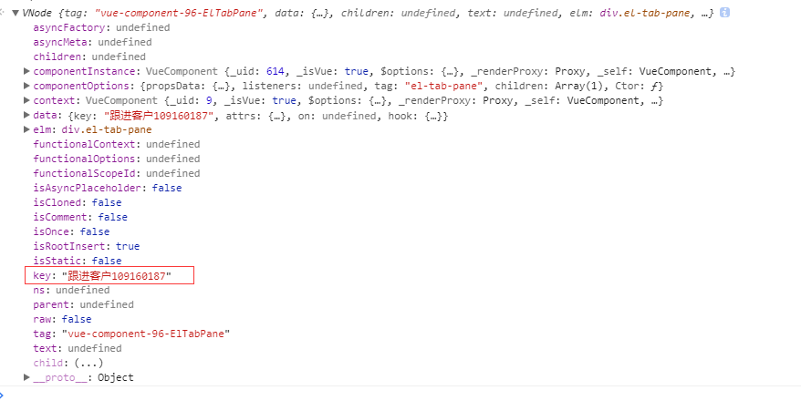

不知道有没有人跟我有同样的遭遇，使用element-ui插件中的el-tabs组件实现多tab窗口，每个tab页签代表一个单独的id，对tab页签进行删除动作时，导致id错乱。

我们系统因业务的特殊性，需要做成多tab页签的形式。刚好element-ui中el-tabs可以满足这种需求。实现这种多tabs的代码如下.

每选中菜单就会多增加一个tab，tab也可以进行删除操作，点击切换操作。同时，每个tab页签的内容部分有使用相同组件的情况.
<!--more-->

例如：


以上两个图片，都是使用相同的FollowUp组件.

问题就发生在，当我删除id为107560489的tab时，发生了id错乱的异常.


红框的id值竟然没有对应变化，本来要删除id为107560489的tab页签,却删除成id为7146246的tab页签内容.

经过多组测试，我发现每次对使用相同组件的tab页签进行删除动作，都会删除掉最后一个tab对应的dom节点.

这个异常困扰了我很久，网上也找了很多资料，做了各种假设。最后问题的解决方法也很简单，就是在el-tab-pane节点里加上属性`:key="item.title"`,给每个tab加上唯一标识，就解决了这个问题。如图红框



<br />
__问题虽然解决了，但我还是不甘心，不止步于单纯的解决问题.
好奇心驱动我去看vue的源码，找出导致错乱的原因.__

<br />
### el-tab-pane没有添加:key。
当点击tab关闭按钮后，vue需要将相应视图从dom节点移除，首先vue会对虚拟节点进行比较.


oldCh代表未删除前的节点，有三个tab，分别代表`客户管理`,`客户跟进107560489`,`客户跟进7146246`.
newCh也即删除后重新构建的虚拟节点，有两个tab，分别代表`客户管理`,`客户跟进7146246`.


可以看到，此时每个vnode节点中的key值为undefined


然后对vnode节点进行比较，图片中`1`是:使用oldCh跟newCh两个数组的开始节点index递增进行比较，当比较的过程中发现有不同的vnode，那么将换用图中`2`的方式进行比较，`2`是将比较顺序换成从数组的结尾index递减比较.

这也很好理解,假设能正确的删除`107560489`对应的dom节点,那步骤将会如下：
oldCh[0] `客户管理` === newCh[0] `客户管理`
oldCh[1] `107560489` !== newCh[1] `7146246`
oldCh[2] `7146246` === newCh[1] `7146246`

但是实际上执行的过程是这样的
oldCh[0] `客户管理` === newCh[0] `客户管理`
oldCh[1] `107560489` === newCh[1] `7146246`
果然，问题就发生在这里，oldCh[1]与newCh[1]相等，那oldCh[2]将会被dom节点遗弃，错误的将`7146246`对应dom节点删除.

##### 为什么两个不同tab页签的vnode节点会相等？
这就要从用来比较vnode的函数入手，于是我找到vue中sameVnode函数
``` javascript
function sameVnode(vnode1, vnode2) {
    return (
        vnode1.key === vnode2.key &&
        vnode1.tag === vnode2.tag &&
        vnode1.isComment === vnode2.isComment &&
        !vnode1.data === !vnode2.data
    )
}
```

很明显，当key值没有设置，使用FollowUp组件的tab页签，tag、isComment、data也是相同的，所以导致oldCh[1] `107560489` === newCh[1] `7146246`成立，sameVnode返回true，最后酿成删除错误节点的情况。当然，我也做了一次添加key的比较.


<br />
### el-tab-pane添加:key。

打印oldCh和newCh的虚拟节点

`key: "跟进客户109160187"`
添加了key后，再调用sameVnode
oldCh[1] `107560489`跟newCh[1] `7146246`就不会相等了.

__另外，为for循环添加key值可以提升操作列表时候渲染dom的性能
__


