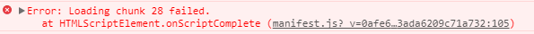
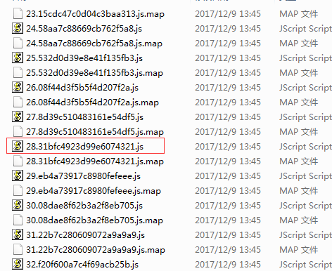
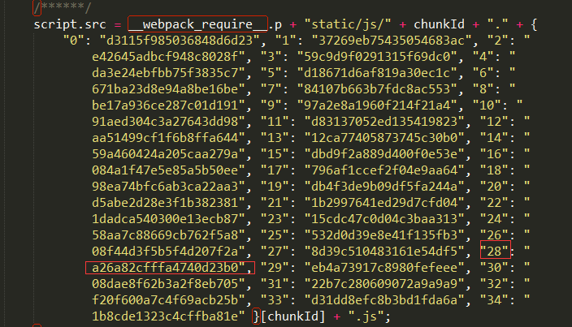
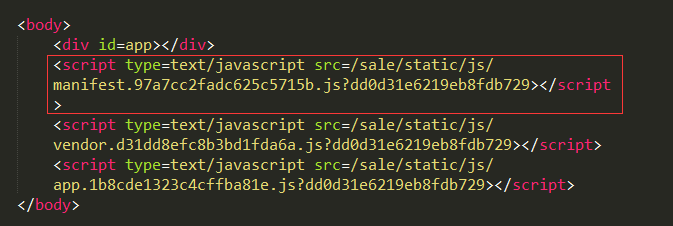
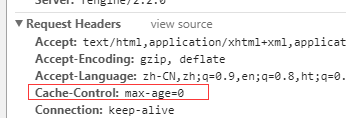

使用vue+webpack开发的一个系统，上线后，频繁收到用户体验系统出现异常的反馈，其中最多的就是类似以下图片中的报错，`Error: Loading chunk ** failed`，导致组件直接打不开。但是刷新页面之后，又可以正常访问组件。

从报错的异常上，可以知道应该是某个chunk文件加载不到，但具体不知道是什么原因导致。我们自己开发的环境重现不了这个错误，实在让人头痛。

我们的vue项目对组件的处理是按需加载的，每个异步组件都会生成不同的chunk分片。项目boss起初怀疑是前端webpack构建有问题，丢失了这个文件。于是我找来了后端的同学，通过查询服务器存放的chunk文件，发现28.js这个chunk是存在的。

文件存在因此可以排除是前端构建异常导致的错误。

<!--more-->
 
#### 服务器存在该文件，为什么还是报这个异常？
经过讨论后，基本可以确定是浏览器缓存文件。但是运维的同学说，不可能存在缓存问题，入口的文件cache-control设置`max-age=0`, 每一次刷新都不会去拿本地缓存。

 
#### 于是我研究了一遍chunk文件生成与浏览器存在缓存的关系
* 我找到了28.31bfc4923d99e6074321.js在项目中还没编译前的文件，修改文件，重新build项目后，构建后该chunk的文件名变为28.a26a82cfffa4740d23b0.js。可以确定，文件修改后，是不会存在缓存的。

* 顺藤摸瓜,我找到了manifest.js引用28.a26a82cfffa4740d23b0.js的代码片段

可以看到，对__28__ 引用hash值也已经更新，也即可以排除manifest.js带来异常的问题
> 当引用异步组件时，执行requireEnsure函数，向dom节点插入js异步组件外链

* 项目build构建后，HtmlWebpackPlugin插件是会将manifest.js文件插入index.html文件，而且index.html为项目的入口文件。那么问题就简单化了，现在只需找到index.html存在缓存就可以确定是缓存问题。

* 不幸的是，并没有像我所想的那样，运维对index.html配置成，每次刷新都会去服务器GET最新文件, index.html刷新页面缓存的想法基本泡汤。

 
#### 大家陷入了沉思，既然服务器文件存在，又不存在文件缓存问题，那报错产生的原因是什么？
突然我们想到一种场景，比如说用户一整天没有关闭我们的系统，然后当晚我们发版，第二天用户继续访问系统，那么index.html文件是不会拿到最新的，那么manifest.js里面28的分片还是31bfc4923d99e6074321，发版后服务器当然不会存在该分片，导致访问文件报错。
经过我的努力，也把该异常重现出来。

 
#### 最后，这里提供几个不成熟的解决方案
1、每次构建，服务器两份文件
2、把hash值拼凑在文件后面，例如28.js?_v=a26a82cfffa4740d23b0,这样每次都能找到28.js文件，当然这只是权宜之计，避免报错而已
3、设置session过期时间，发版之后，重新跳转到登录页面。
