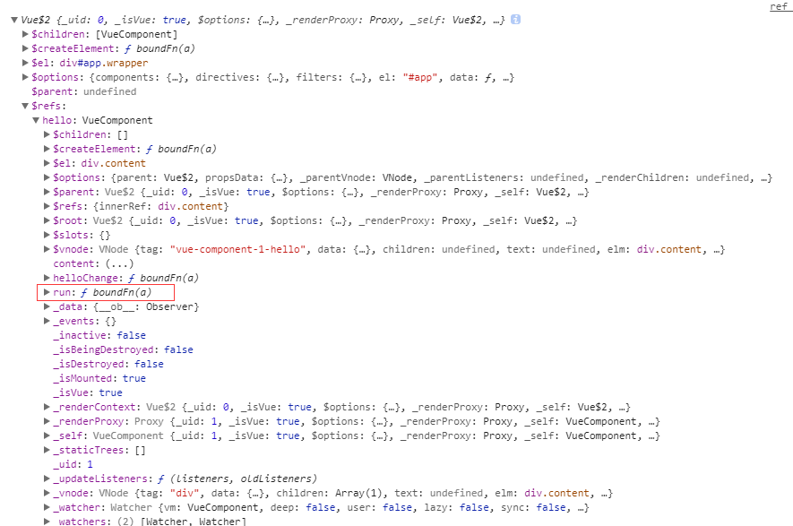

据我所知，vue父组件要调用子组件中的方法有两种
* 第一种是直接给子组件添加ref值，通过$refs调用子组件内方法.
```javascript
<div>
    <hello ref="helloRef"></hello>
</div>

new Vue({
    ...
    mounted: function () {
        // 假设hello子组件中含有run方法
        this.$refs.helloRef.run();
    }
})
```
<!--more-->

* 第二种是使用watch，监视值改变，触发函数`简称props方式`
```javascript
<div>
    <hello :status="status"></hello>
</div>

const hello = {
    props: ['status'],
    ...
    methods: {
        run: function () {
            console.log('I am running');
        }
    },
    watch: {
        status: function () {
            this.run();
        }
    }res
}

new Vue({
    ...
    mounted: function () {
        // status值必须改变，若值还是原来的值，那不会触发子组件的watch
        this.status = !this.status;
    }
})
```

___
我们的项目中，起初的时候缺乏规范，导致开发者使用了不同的调用方式。一个系统中对一种操作，出现了不同的方式，这是很不好的现象。
于是，为了规范，我提出了统一使用props方式。我提倡使用props方式的理由是，`第一点: 函数的调用全部封装在子组件内部，便于维护；第二点: 使用ref方式时，时常会出现报错现象，例如`<span style="color: #ff0000">Uncaught TypeError: Cannot read property 'hello' of undefined</span>

然而却遭到其他人的反对，因为他们觉得props方式需要监听watch，并且要特意的去改变watch值，过于麻烦，相反ref会更简单些。

短时间内我也说服不了大家使用props方式，趁这段时间有空，测试了一下两种方式在性能上的差异。

<br />
#### ref
组件对象提供一个$refs属性, $refs存放着ref数组, ref提供了相应对象的引用.若被引用节点是自定义组件则返回一个VueComponent对象，就像上面的hello；若被引用节点是一个dom节点，则返回dom节点的引用。

还是以上面子组件hello为例：

调用__this.$refs.helloRef__返回hello组件的VueComponent对象, VueComponent对象包含了组件methods的所有方法，所以可以直接通过helloRef调用子组件methods中的方法
```
this.$refs.helloRef.run(); // I am running
```
<span style="color: #ff0000">另外，在mounted阶段才会将子组件对象赋值给$refs，所以在created中调用$refs是不会存在helloRef值的。Uncaught TypeError: Cannot read property 'hello' of undefined报错的原因也明朗了</span>

<br />
#### props
> props分析起来就没有ref简单，首先要知道props是怎么传值到子组件的, 然后触发watch去执行相应函数

status值改变后，会触发对象watcher，执行__vm._update(vm._render(), hydrating)__更新子组件 （render主要作用是生成解析函数）
```
<div id="app">
    <div>
        <hello :status="status"></hello>
    </div>
</div>

// 这样的模板将会被渲染成
(function() {
with(this){return _h('div',{attrs:{"id":"app"}},[_h('div',[_h('hello',{attrs:{"status":status}})])])}
})
```
with(this), 可以发现属性status是从父组件拿data的status值.

子组件中status值改变后，触发watch，执行run函数. __这个过程比较消耗性能，会重新创建hello的虚拟节点vnode，比较新老vnode节点后重新渲染组件__.


<br />
__分析两者的差别后，理论上来说，props会比ref更消耗性能，于是我做一个demo来比较两者性能上的差异__

demo如下：
```html
<!DOCTYPE html>
<html lang="en">
<head>
    <meta charset="UTF-8">
    <title>Document</title>
</head>
<body>
    <div id="app" class="wrapper">
        <div class="box">
            <hello ref="hello" :content="helloContent"></hello>
        </div>
    </div>
    <script src="js/vue.js"></script>
    <script>
        const hello = {
            props: ['content'],
            template: '<div class="content">{{ content }}</div>',
            created: function () {
                console.log('child created');
            },
            mounted: function () {
                console.log('child mounted');
            },
            methods: {
                run: function () {
                    console.timeEnd('helloRun');
                },
                helloChange: function () {
                    console.timeEnd('helloChange');
                }
            },
            watch: {
                content: function (newVal, oldVal) {
                    this.helloChange();
                }
            }
        }

        const other = {
            props: ['content'],
            template: '<div class="content">{{ content }}</div>',
            created: function () {
                console.log('second created');
            },
            mounted: function () {
                console.log('second mounted');
            }
        }

        const vue = new Vue({
            el:'#app',
            data: {
                helloContent: 'first content',
                otherContent: 'second content'
            },
            created: function () {
                let that = this;

                console.log('created');
            },
            mounted: function () {
                let that = this;

                console.log('mounted');
                console.time('helloRun');
                that.$refs.hello.run();

                console.time('helloChange');
                that.helloContent = 'change content';
            },
            components: {
                hello,
                other
            }
        });
    </script>
</body>
</html>
```

执行后，console打印：
* helloRun: 0.05712890625ms
* helloChange: 1.541015625ms
多次刷新，比较数据后，发现helloChange消耗大概1.5毫秒，helloRun消耗大概0.05毫秒，整整相差了30倍。__props之所以会这么耗时，是因为每次更新值后，都会触发生命周期的update__。
在模板中添加多个子组件更能体现这种效果，例如
```html
<div class="box">
    <hello ref="hello" :content="helloContent"></hello>
    <template
        v-for="item in 1000">
        <other :content="otherContent"></other>
    </template>
</div>
```
添加了1000个other的子组件
console打印：
* helloRun: 0.041015625ms
* helloChange: 16.389892578125ms

<br />
经过分析后，我发现如果需要调用子组件的方法，最好通过ref方式。当组件功能越多、模板越复杂的情况下，使用props传值去触发子组件的方法是很耗费性能。


